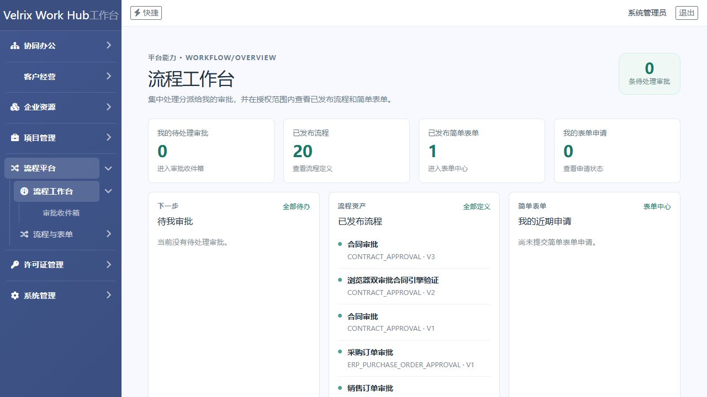
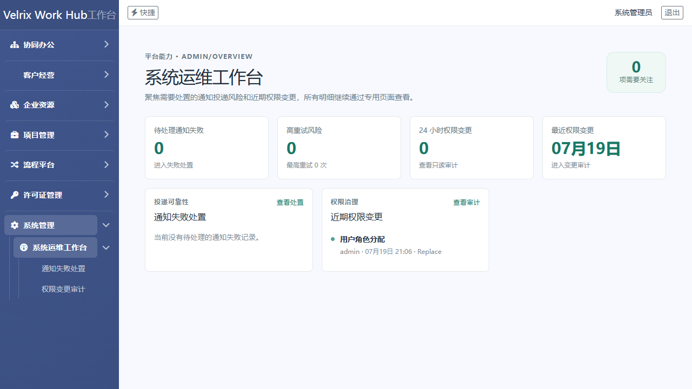
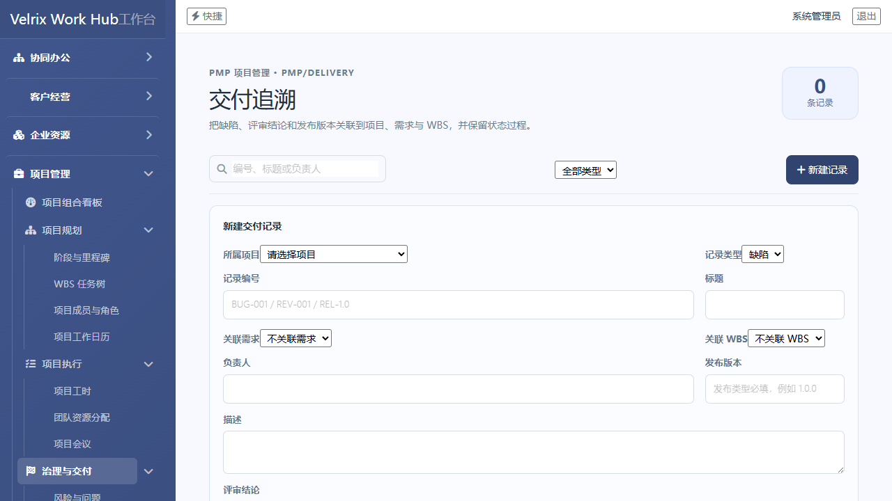
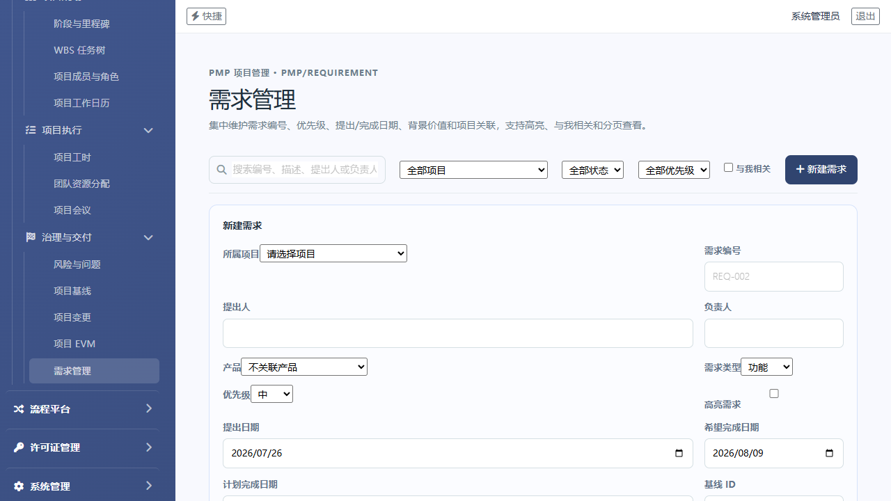
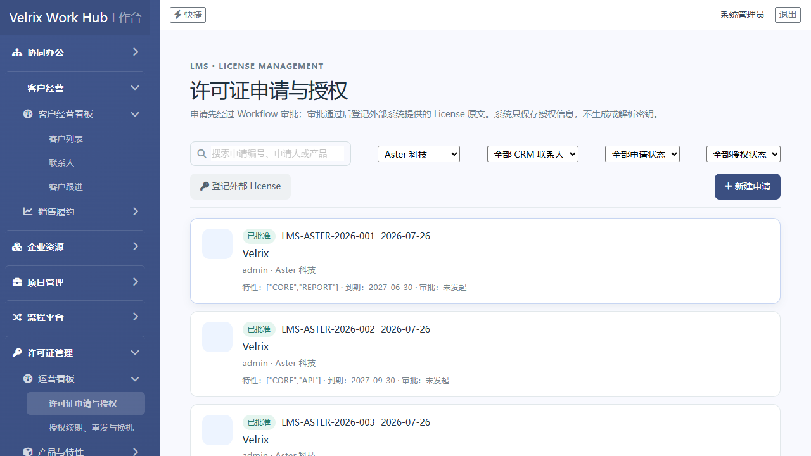
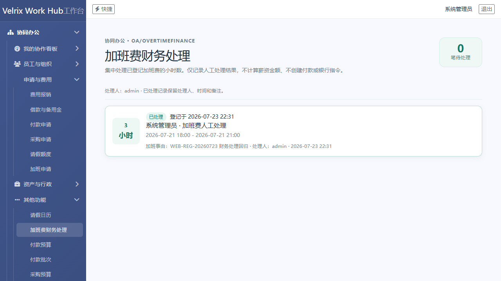
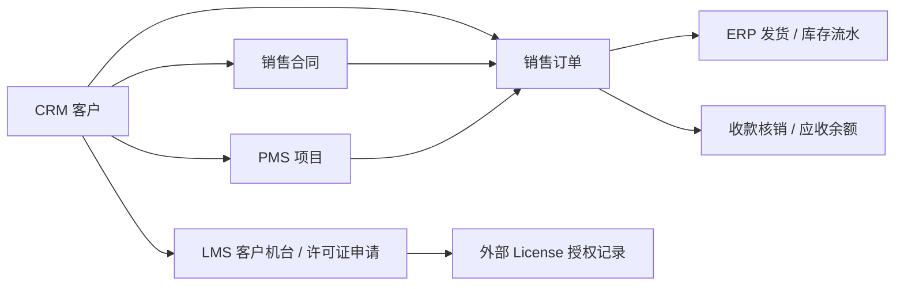

# Velrix Work Hub

基于 .NET、Blazor Server、FreeSql 与 PostgreSQL 构建的模块化企业工作台，目标是统一承载协同办公、客户经营、订单库存、项目管理与通用流程审批。

## 当前阶段

当前已完成平台基础能力和核心业务模块的第一阶段闭环，重点是可复用的 Workflow 流程纯引擎、业务状态门禁、制造运营（MOM）主链与 PostgreSQL 持久化。

## 设计理念

- 不是把 OA、CRM、ERP、PMS 和许可证页面堆到同一个菜单，而是让模块独立演进的同时，共享关键主数据引用、权限边界、流程运行时和可追溯的业务状态。
- 系统关注的不只是“能否录入一张单”，而是业务动作发生后，状态、审批、库存、通知和审计是否保持一致；流程审批通过并不替代业务规则，业务状态仍由各模块的 Application 用例控制。
- Workflow 是跨业务的共同语言。合同、订单、项目变更、核销和许可证申请复用同一套版本、待办、转交、退回、重提、并行汇聚与事务边界，而不是各自实现审批表和状态机。
- Blazor Server 让页面渲染和业务数据默认留在服务端，减少不必要的数据下发；这不是权限校验的替代，所有授权、数据范围和状态门禁仍在服务端强制执行。
- 技术选型优先服务于长期维护、数据一致性和部署可控性：以 PostgreSQL 为主要目标，保留 SQL Server 适配，避免把核心业务建立在特定操作系统或本地自动化组件上。

## 典型界面

这些截图来自已完成的 PostgreSQL 浏览器回归，作为产品能力和回归状态的代表性素材；完整测试证据仍归档在本地 `artifacts/`。

| 场景 | 截图 |
|---|---|
| 流程资产、待办与简单表单统一入口 |  |
| 通知失败风险与权限变更的系统运维视图 |  |
| 项目交付记录关联项目、需求和 WBS，并保留状态追溯 |  |
| 项目需求的优先级、基线、计划日期与项目上下文维护 |  |
| CRM 客户上下文下的许可证申请与授权查询 |  |
| 加班费的财务人工处理记录与审计回显 |  |

## 跨模块关联：从 CRM 客户出发

CRM 客户是客户身份、名称和启停状态的唯一主数据。合同、销售订单、项目和许可证不复制一份客户资料，而是保存稳定的客户引用；因此从一个客户可回看商业机会、履约、交付和授权状态，客户被停用或删除时也能先看到受影响对象，而不会留下断开的关联。



- 合同审批通过后生效；销售订单可以同时关联客户、合同与项目，发货和收款核销继续保留订单来源。
- PMS 项目以 CRM 客户为上下文，汇总关联合同、订单、发货、回款和应收，不直接复制 ERP 交易表。
- LMS 客户机台、许可证申请和授权只持有 `CustomerId` 等稳定引用；外部 License 原文由外部系统提供，Velrix Work Hub 只保存受控授权记录，不生成或解析密钥。
- 客户主数据的引用影响会汇总到联系人、跟进、合同、订单、项目和 LMS 授权上下文，存在历史引用时禁止物理删除，优先使用停用来收敛新业务入口。

## 已开发模块与主要功能

- Admin：用户、角色、菜单、按钮权限、参数、字典、文件、通知、任务调度、节假日和授权审计。
- OA 协同：待办收件箱、通知中心、审批操作历史和发起人撤回。
- CRM：客户经营与销售合同；合同可由流程审批驱动生效，并保留可追溯的业务状态与操作记录。
- ERP：商品、仓库、库位、供应商、采购订单、销售订单、出入库、调拨、盘点、核销和基础对账报表；库存以不可变流水计算余额。
- PMS：项目、项目变更与项目相关审批门禁；项目变更可从业务字段解析审批人。
- MOM：制造工单、BOM/MRP、物料齐套与领料、工序执行、质量检验、完工入库、发运、FAT/SAT、售后设备、安装维修和维修备件消耗；制造事实与 ERP 库存、CRM 客户、销售订单、PMS 项目保持稳定引用和可追溯闭环。
- LMS：许可证申请、统一审批、外部 License 授权登记、特性配置与 `OtherInfo` 扩展信息；系统不生成或解析密钥原文。
- Workflow：版本化流程定义、运行实例快照、审批待办、通知、条件分支、受控循环、退回、撤回、转交、并行 Split/Join 汇聚和自动业务动作。
- 审批策略：支持全员同意（`All`）、任意一人同意（`Any`）、超过半数同意（`Majority`）和固定票数通过（`Quorum`）；支持审批人快照、轮次隔离、转交链与待办幂等补偿。
- 运行可靠性：流程实例与待办使用 Revision/CAS 乐观并发；启动、审批、撤回、退回、自动动作、并行汇聚和会签取消均采用事务边界，失败可回滚并保留必要审计。
- 数据库：以 PostgreSQL 为主要运行和验证目标，同时保留 SQL Server 适配能力。

## 典型跨模块场景

- 合同到履约：CRM 合同通过 Workflow 审批后生效；销售订单关联客户、合同和项目，后续发货、收款核销和应收余额可从客户、合同和项目视图双向追溯。
- 项目交付控制：PMS 项目以 CRM 客户为上下文，汇总关联合同、销售订单、发货、回款和应收；项目变更必须经过统一审批后才能进入实施。
- 订单与库存：ERP 采购订单、销售订单和库存流水保持状态门禁；收货、发货、调拨、盘点和取消后的库存余额均基于有效流水计算，核销结果同步反映在客户/供应商往来视图。
- 统一审批协作：合同、项目变更、核销、采购订单、销售订单和许可证申请共用 Workflow、待办收件箱、通知、操作历史、撤回、转交和重提能力；审批页可回跳业务原单，业务原单也可查看对应审批。
- 许可证授权：LMS 申请通过统一 Workflow 审批后，再登记外部系统提供的 License 原文；授权记录保留申请、产品、特性、到期时间和扩展信息，不将密钥生成规则固化在系统中。
- 制造到售后：MOM 从生产工单、物料齐套、工序和质量开始，继续记录完工入库、发运、客户设备、安装维修和维修备件消耗；库存余额只由 ERP Application 统一维护，MOM 保存制造和现场服务的业务追溯事实。
- MOM 演进计划：先完成 Web 端制造执行和售后服务闭环，再补备件退料/库存逆向、批次与包装、序列号生命周期、PDA、标签打印、工位终端和设备数据接入；移动端与小程序放在 Web 主线稳定之后。


## 许可

Velrix Work Hub 采用双重许可：

- 个人用户和非商业使用者可以选择 [GPL-3.0-or-later](LICENSE)；选择 GPL 后，必须完整遵守 GPL，包括其关于复制、修改、再分发和提供对应源代码的要求。
- 企业如果需要闭源商业部署、内部专有使用、商业支持或不希望承担 GPL 的再分发义务，应取得 [商业许可](COMMERCIAL-LICENSE.md)。商业许可禁止未经书面授权出售、转售、公开发布或向无权主体提供源代码。

GPL 与商业许可是两条独立授权路径。GPL 本身允许在满足 GPL 条件时收费和再分发，因此“不得倒卖源代码”只能作为商业许可的限制，不能作为 GPL 的附加限制。正式企业采购前请由法务审阅并签署商业授权书。

## 运行

默认使用本机 PostgreSQL。首次启动会自动同步基础结构，并创建开发管理员和基础业务菜单；投入共享环境前必须修改数据库连接与管理员密码。

默认开发管理员：

- 用户名：`admin`
- 密码：`admin`

仅用于本地开发和演示；部署到共享或生产环境前必须修改管理员密码和数据库连接。

```powershell
dotnet build VelrixWorkHub.slnx
dotnet test VelrixWorkHub.slnx
dotnet run --project src/VelrixWorkHub.Web
```
